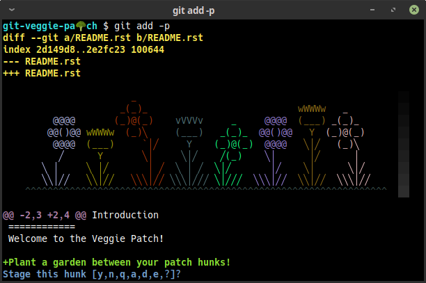

@@@@@@@@@@@@@@@@
git-veggie-patch
@@@@@@@@@@@@@@@@

#####
Usage
#####

Injects a colorful flower bed atop each hunk of a ``git add -p``
interactive patch session.

`Read my article <https://tallybark.com/post/git-vegetables/>`__
on Tally Bark.

#####
Setup
#####

`Copy from <https://github.com/landonb/git-veggie-patch/blob/release/.gitconfig.example#L2-L3>`__
``.gitconfig.example`` to your user's ``~/.gitconfig``,
or run the command::

  git config --global interactive.diffFilter diff-filter-garden

#######
Caveats
#######

Git will not call ``diffFilter`` unless ``ui.color`` is enabled.

############
Known Issues
############

There is a regression in Git v2.37 where the interactive patch feature
fails on color codes, and you won't see your garden.

(And if you fiddle with the code, you'll see a message from Git,
"error: could not parse colored hunk header".)

- This regression was fixed in the following Git version, Git v2.38.

  However, as of 2022-10-25, macOS has not yet updated from Git v2.37.

  To work-around this issue, add the following setting to your ``.gitconfig``.
  It will disable the new ``git add -p`` code, which was freshly rewritten
  in C, and revert to Git's old implementation::

    [add "interactive"]

      useBuiltin = false

